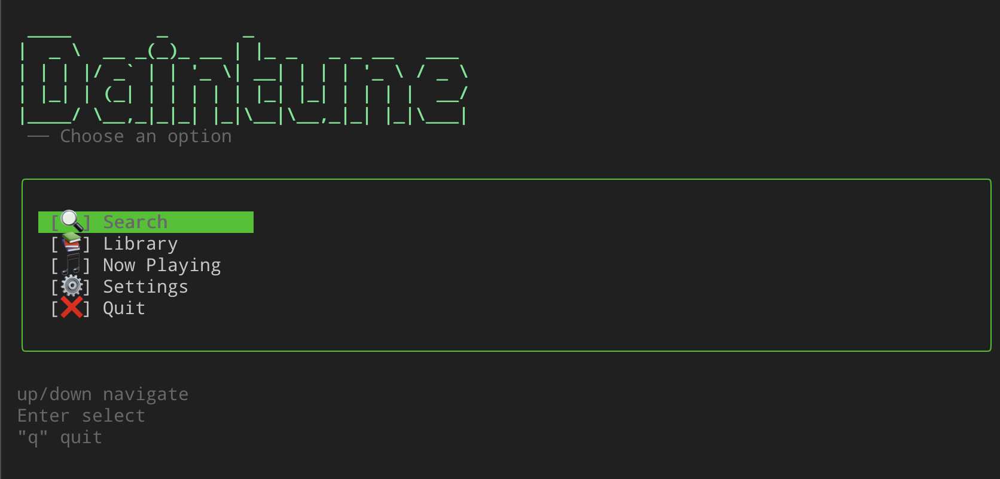

```
 ____        _       _
|  _ \  __ _(_)_ __ | |_ _   _ _ __   ___
| | | |/ _` | | '_ \| __| | | | '_ \ / _ \
| |_| | (_| | | | | | |_| |_| | | | |  __/
|____/ \__,_|_|_| |_|\__|\__,_|_| |_|\___|
```




> A terminal-based music player. Search, organize, and play music directly from your command line — no browser needed.


---

## Prerequisites

Requires `mpv` and `yt-dlp` on your system.

**macOS**
```bash
brew install mpv yt-dlp
```

**Ubuntu / Debian**
```bash
sudo apt install mpv
sudo curl -L https://github.com/yt-dlp/yt-dlp/releases/latest/download/yt-dlp -o /usr/local/bin/yt-dlp
sudo chmod a+rx /usr/local/bin/yt-dlp
```

**Windows** — Not currently supported (requires Unix socket support).

---

## Installation

> **Note:** npm distribution has been discontinued due to YouTube ToS concerns around `yt-dlp` and `yt-search`.

Clone and link locally:

```bash
git clone https://github.com/DainPark-web/Daintune.git
cd Daintune
npm install
npm run build
npm link
```

This creates a global `daintune` command on your machine only — nothing is published or shared.

---

## Usage

```bash
daintune
```

---

## Features

| | Feature | Description |
|---|---|---|
| 🔍 | **Search** | Search YouTube and play audio instantly |
| 📚 | **Library** | Organize tracks into playlists |
| 📋 | **Queue** | Search results and playlists play as a continuous queue |
| ⚙️ | **Settings** | Toggle Repeat, Shuffle, and Autoplay Next |

---

## Keybindings

**General**

| Key | Action |
|---|---|
| `↑` `↓` | Move selection |
| `Enter` | Confirm / Play |
| `Esc` | Go back |

**Now Playing**

| Key | Action |
|---|---|
| `Space` | Pause / Resume |
| `r` | Restart current track |
| `n` | Skip to next in queue |
| `a` | Add to playlist |
| `Esc` | Back to previous screen |

**Library**

| Key | Action |
|---|---|
| `Enter` | Open playlist / Play |
| `c` | Create new playlist |
| `r` | Remove selected item |
| `Esc` | Go back |

**Search**

| Key | Action |
|---|---|
| `Enter` | Play from selected result |
| `a` | Add to playlist |
| `Esc` | Back to search input / Menu |

---

## Tech Stack

[Ink](https://github.com/vadimdemedes/ink) · [yt-search](https://github.com/talmobi/yt-search) · [mpv](https://mpv.io/) · [yt-dlp](https://github.com/yt-dlp/yt-dlp)

---

## Contributing

Contributions are welcome! Please read [CONTRIBUTING.md](CONTRIBUTING.md) before submitting a pull request.

---

## License

MIT + Commons Clause © Dain Park — see [LICENSE](LICENSE) for details.

Free for personal and educational use. Commercial use, resale, or monetization is not permitted.
